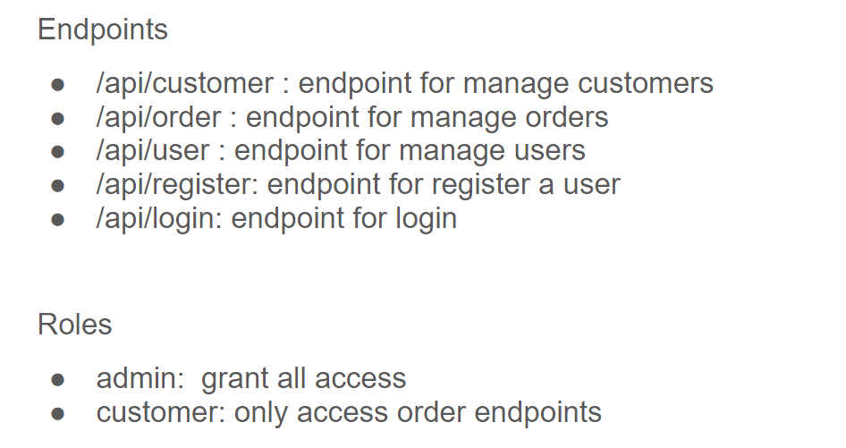
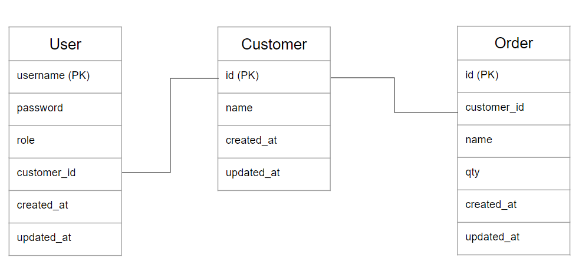

# gin-dbo
simple service for doing manage Login,Customer, and Order using Gin Framework
# Design



# ERD


# How to Use

- clone the repository
```git clone https://github.com/ihsanul14/gin-dbo```

- create a new database in MySQL

- create a ```.env``` files based on ```.env.example``` and match the value with your environment (use host.docker.internal if you are using your local MySQL host)

- build and run the application using docker

```
docker build . -t gin-dbo
docker run -d --name gin-dbo -p 30001:30001 gin-dbo
```

- access the service in http://localhost:30001 <br>
- access the swagger in http://localhost:30001/swagger/index.html